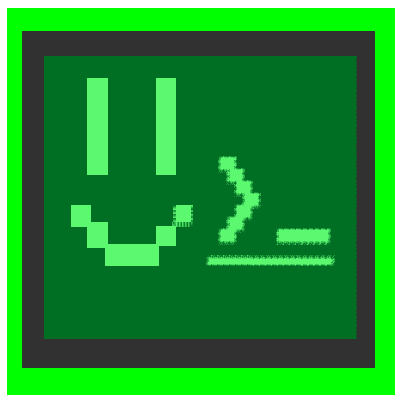

    a NodeJS toolbox.

# xk-npm-lib
This nodejs repo is for storing javascript modules and other files. 
#   Links
[`documentation`](./docs/README.md)
##  Contents
 
Contents of this library may include: 

The Following File Types
| type | ext |
| ---- | --- |
| css style sheets |.css|
|javascript |.js|
|Node.js ES Modules|.mjs|
|Coffee Script|.coffee|
|font files|.ttf, .otf|
|         |         |

- css stylesheets
- javascript 
##  Documentation/ Markdown files

- [`SECURITY POLICY`](SECURITY.md)

#   Features

